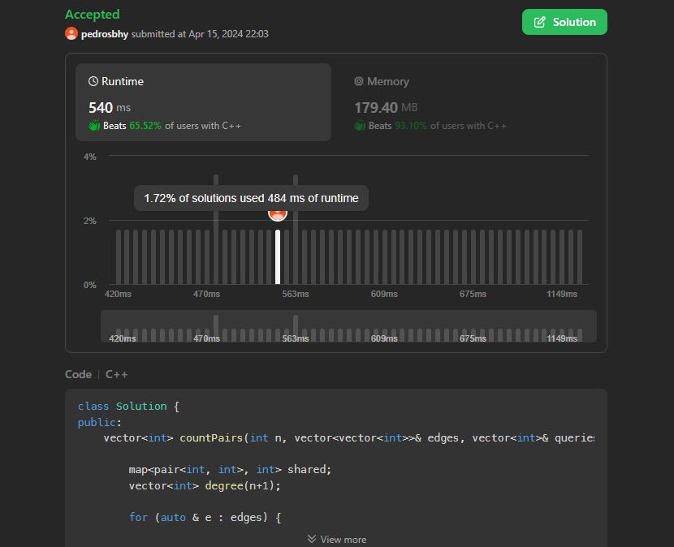

# Problemas LeetCode

**Número da Lista**: 1 
**Conteúdo da Disciplina**: Grafos 1 

## Alunos

| Matrícula  | Aluno                        |
| ---------- | ---------------------------- |
| 21/1039250 | Arthur Grandão de Mello      |
| 21/1029540 | Pedro Sena Barbosa Holtz Yen |

## Sobre

Foram resolvidos quatro problemas retirados do site [LeetCode](https://leetcode.com).

1. [787](https://leetcode.com/problems/cheapest-flights-within-k-stops/description/). Cheapest Flights Within K Stops (Medium)
2. [210](https://leetcode.com/problems/course-schedule-ii/description/). Course Schedule II (Medium)
3. [1377](https://leetcode.com/problems/frog-position-after-t-seconds/description/). Frog Position After T Seconds (Hard)
4. [1782](https://leetcode.com/problems/count-pairs-of-nodes/description/). Count Pairs Of Nodes (Hard)

## Screenshots

- 210
  

- 787
  

- 1377
  

- 1782
  

## Instalação

**Linguagem**: C++ 
**Framework**: (caso exista) 
Descreva os pré-requisitos para rodar o seu projeto e os comandos necessários.

## Uso

Explique como usar seu projeto caso haja algum passo a passo após o comando de execução.

## Outros

Quaisquer outras informações sobre seu projeto podem ser descritas abaixo.
